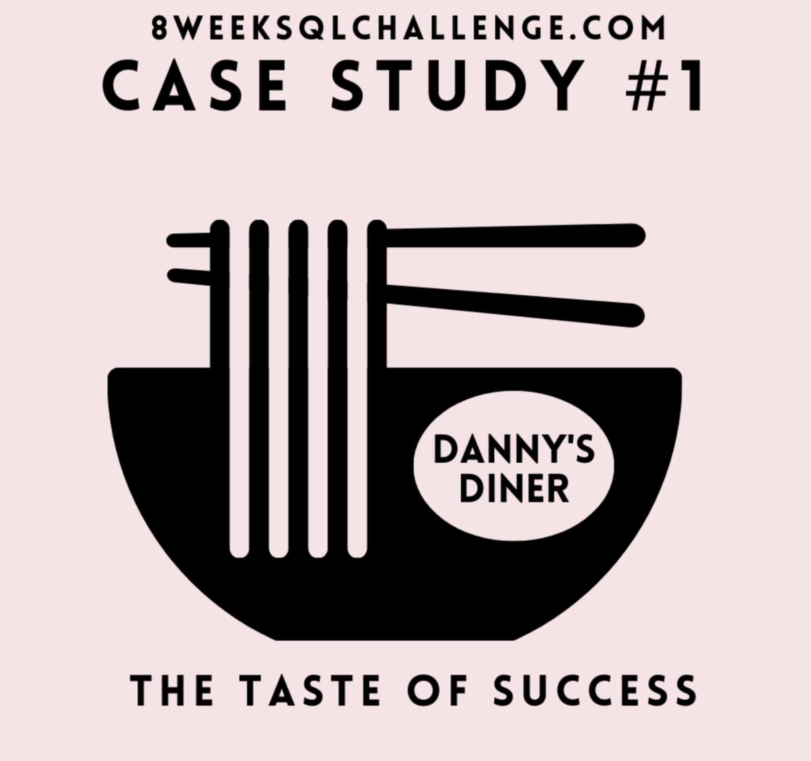

# Welcome to My Portfolio

---

### Learn About My Projects

#### [My 21 days to Data](https://www.linkedin.com/pulse/21-days-data-oussama-bechar/)
Google sheets | SQL | Python

My first experience with data projects involved exploring The New York City crime data and extracting fascinating insights from it.

---

#### [JB Link Telecom: Customers Churn](https://www.linkedin.com/pulse/telecom-company-customers-churn-oussama-bechar%3FtrackingId=2fbBPpkXTU65vs%252F5bATJlg%253D%253D/?trackingId=2fbBPpkXTU65vs%2F5bATJlg%3D%3D)
EXCEL
  

After conducting comprehensive data cleaning, thorough exploration, and in-depth analysis of JB Link Telecom data, I've extracted valuable insights that will play a crucial role in enhancing customer retention strategies for the company.

---

#### [Dannys Challenge](https://github.com/oussama-bechar/DannysDinner/blob/master/Desktop/dannys/Dannys_Challenge)
 SQL (PostgreSQL)

I had to explore data to answer Danny's questions and help the restaurant stay afloat.
In this case study, I've used basic SQL functions, and also advanced ones like CTEs, windows functions and joins.

wawaaaaaaaaaaa